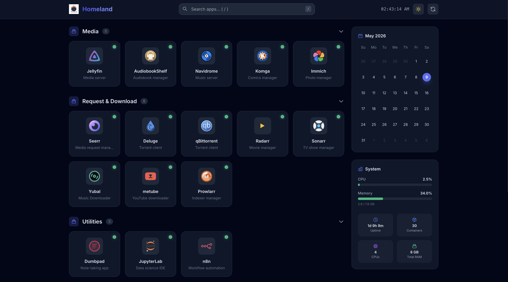

# Homeland 🏠

A lightweight, self-hosted homepage dashboard for homelab environments. Built with **Go**, **HTMX**, **Alpine.js**, and **Tailwind CSS**.


---

## ✨ Features

- **App Grid** — Responsive grid with icons, grouped into collapsible sections
- **Health Monitoring** — Real-time HTTP/TCP health checks with visual status dots
- **Docker Auto-Discovery** — Automatically detects running containers via Docker labels
- **System Metrics** — CPU, memory, uptime, and container count widgets
- **Calendar Widget** — Minimal current month calendar with today highlighted
- **Instant Search** — Fuzzy search with `/` keyboard shortcut
- **Dark Mode** — Beautiful dark theme with toggle and persistence
- **Hot Reload** — Config changes apply without restart
- **Basic Auth** — Optional authentication toggle
- **REST API** — JSON endpoints for all data
- **Icon Fetching** — Automatic icons from [selfh.st](https://selfh.st/icons) CDN

---

## 🚀 Quick Start

### Docker Compose (Recommended)

```bash
git clone https://github.com/abhixops/homeland.git
cd homeland
docker compose up -d
```

Open [http://localhost:3000](http://localhost:3000)

### From Source

```bash
# Install dependencies
go mod download
npm install

# Build Tailwind CSS
npx tailwindcss -i web/static/css/app.css -o web/static/css/tailwind.css --minify

# Run
go run ./cmd/homeland/
```

---

## ⚙️ Configuration

Edit `configs/homepage.yaml`:

```yaml
settings:
  title: "My Homelab"
  port: 3000
  theme: dark
  health_check:
    interval: 30
    timeout: 5
  auth:
    enabled: false
    username: admin
    password: changeme

groups:
  - name: Media
    apps:
      - name: Jellyfin
        url: http://localhost:8096
        icon: jellyfin
        description: Media server
        healthcheck:
          type: http
          endpoint: /health
```

Changes are auto-detected and applied without restart.

---

## 🐳 Docker Auto-Discovery

Add labels to your containers:

```yaml
services:
  jellyfin:
    image: jellyfin/jellyfin
    labels:
      homepage.name: Jellyfin
      homepage.icon: jellyfin
      homepage.url: http://localhost:8096
      homepage.group: Media
      homepage.description: Media streaming
```

---

## 📡 API Endpoints

| Method | Endpoint              | Description              |
|--------|-----------------------|--------------------------|
| GET    | `/api/apps`           | List all apps            |
| GET    | `/api/health`         | All health statuses      |
| GET    | `/api/health/:app`    | Single app health        |
| POST   | `/api/reload`         | Reload YAML config       |
| GET    | `/api/docker/discover`| Trigger Docker discovery |
| GET    | `/api/metrics`        | System metrics           |

---

## 📁 Project Structure

```
cmd/homeland/        → Entry point
internal/
  config/            → YAML loader + hot-reload
  health/            → HTTP/TCP health checker
  docker/            → Docker auto-discovery
  icons/             → Icon fetching + caching
  metrics/           → System metrics (CPU/Mem/Uptime)
  auth/              → Basic auth middleware
  api/               → HTTP handlers + templates
web/
  templates/         → Go HTML templates (HTMX)
  static/            → CSS, JS, cached icons
configs/             → YAML config files
```

---

## 🗾 Screenshot

<div align="center">
  
</div>

---

NOTE: User authentication is disabled by default, and the application ships with a default username and password. If you want to enable user authentication, please change the default credentials first.

---

## 📝 License

MIT
